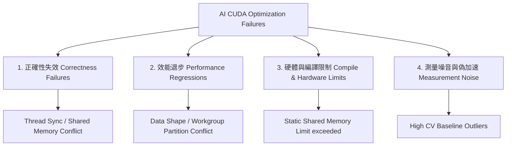

# HeCBench AI 輔助優化研究核心分析與失敗成因探討

本文件旨在探討利用 AI 協助優化現有 GPU Benchmark 的核心研究設計，並結合 **HeCBench Phase 3** 的實際實驗數據（`softmax-cuda`、`topk-cuda`、`shmembench-cuda`），深入分析「優化失敗案例」的工程與科學成因。

---

## 1. 研究核心定位：AI 輔助優化的科學範式

在 AI 輔助 CUDA 程式優化的研究中，核心研究問題並非僅僅是「AI 能跑多快」，而是：
1. **優化空間判定**：AI 在面對不同硬體限制與演算法瓶頸下，優化行為的極限與收斂路徑。
2. **失敗模式分析**：在挑選的測試集中，為何部分案例能成功加速，而另一半案例卻以失敗（正確性錯誤、退步或無法編譯）告終。

### 1.1 案例對比：15 題成功 vs 15 題失敗的探討架構

假設從 HeCBench 中挑選 30 題讓 AI 進行自動優化，最終產生 **15 題成功** 與 **15 題失敗** 的雙峰分布。這種「半數失敗」的結果在學術上具有極高的研究價值。學生與研究者需探討的失敗成因，可依據 HeCBench Phase 3 實際觀測到的現象，歸納為以下四大失效維度（Taxonomy of Optimization Failures）：

---

## 2. 連結 HeCBench 實戰：四大失敗成因深度解析

我們將上述失敗分類架構，與當前 **Phase 3** 的具體實驗結果進行深度連結：

### 2.1 失敗類型一：正確性失效 (Correctness Failures)
* **科學原理**：GPU 的高並發架構依賴極為精準的執行緒同步（Thread Synchronization）與共享記憶體（Shared Memory）定址。AI 在撰寫 Kernel 時，常因忽略 Race Condition、遺漏 `__syncthreads()` 或邊界判定錯誤，導致計算結果與 CPU Reference 不符。
* **HeCBench 實證連結**：
  * 在 **`softmax-cuda` Mode B Round 1** 中，AI 提出了 compound candidate (`impl=2`，結合了 block-per-slice 與共享記憶體快取指數項）。在進行 `slice=256` 的 3 次重複測試中，有 **1 次 trial 回報 correctness FAIL**（出現誤差值如 `host: 0.004004 device: 0.000000`），直接導致該候選版本被主規劃器拒絕作為全面替代方案。
  * **`shmembench-cuda` Mode A** 中，當 `block_size` 被調整為 128 與 512 時，雖然程式得以編譯並執行，但驗證 checksum 直接回報 **FAIL**。這揭露了原始測試的校驗機制與 `block_size=256` 存在硬性耦合，AI 盲目調整執行緒配置會直接破壞數據流正確性。

### 2.2 失敗類型二：效能退步 (Performance Regressions)
* **科學原理**：GPU 的優化與資料形狀（Data Shape，如矩陣大小、Slice 長度）密切相關。一個在大型形狀下表現優異的優化邏輯，可能會因為執行緒開銷（Overhead）過大，在小型形狀下產生嚴重的效能倒退。
* **HeCBench 實證連結**：
  * **`softmax-cuda` Mode B Round 1** 的 `impl=2` 雖然在較大 slice（784, 1024, 2048）取得了 **1.3x - 1.59x** 的加速，但在 `slice=128` 的小型形狀下，效能暴跌至僅有原來的 **0.243x**（變慢了近 4 倍）。
  * **人機協作收斂**：人類審查介入（Human-in-the-loop Gate）識別出了這個「局部有效但整體失敗」的特徵，引導 AI 在 Round 2 中建立 **Shape-Aware Dispatch Policy (`impl=3`)**——在小 shape 時調用 warp-level `impl=1`，大 shape 時才調用 block-level `impl=2`，成功將 Round 1 的失敗轉化為最終的成功。

### 2.3 失敗類型三：編譯或硬體限制失效 (Hardware & Compiler Constraint Limits)
* **科學原理**：GPU 的物理資源（暫存器數量、靜態共享記憶體容量）是有限的。AI 若在不了解目標 GPU 架構（如 V100, sm_70）的前提下過度分配共享記憶體，會直接導致編譯失敗。
* **HeCBench 實證連結**：
  * 在 **`shmembench-cuda` Mode A / Mode B** 中，當 AI 嘗試使用 `block_size=1024` 進行測試時，NVCC 編譯器直接報錯中斷（`shared memory exceeds limit`）。
  * **成因分析**：V100 每個 Thread Block 的靜態共享記憶體上限為 48KB/96KB。AI 在 1024 個執行緒配置下，分配 of 靜態數組大小超出了硬體限制，導致此優化路徑在編譯階段即告失敗。

### 2.4 失敗類型四：測量變異與偽加速失效 (Measurement Noise & Pseudo-Speedup)
* **科學原理**：在高變異數（High CV）的 GPU 測量環境中，單次運行時間常會因為離群值（Outliers）而產生巨大波動。AI 若僅依靠 3 次試驗的平均值，常會將「Baseline 的偶發性變慢」誤判為「AI 程式優化成功」。
* **HeCBench 實證連結**：
  * 在 **`topk-cuda` Mode A** 中，AI 在沒有修改任何原始碼的情況下直接重測，但在 `hidden_size=4096, topk=2048` 案例中測得了 **1.415x** 的「假加速」。
  * **深入探討**：審核發現，該 Baseline 測試的 CV 值高達 **54.6%**（存在極端離群值 1951 us），而 Final 測試時環境恢復穩定（CV = 11.2%）。這證明若不進行「Robust Baseline」多輪重測與方差過濾，高噪音會使失敗（無實質優化）被誤判為成功。在 Mode B 中，我們透過強制執行 **7次 trials** 成功穩定了該測量。

---

## 3. 人機協作（Human-in-the-loop）在「失敗收斂」中的定位

在本項研究中，**人類操作者（Human Operator）** 的價值不在於徒手編寫更高效的程式，而是在於**管理與診斷失敗**：

| AI 獨立行為 (Mode A) | 人機協作介入 (Mode B) | 研究價值與對比 (RQ3-1 / RQ3-2) |
| :--- | :--- | :--- |
| 面對小型 shape 退步或局部 correctness 錯誤，AI 會直接放棄該 Benchmark，或誤報整體 SUCCESS。 | 人類識別退步邊界，引導 AI 撰寫 Shape-Aware Dispatch (`impl=3`) 分流執行。 | **將局部失效轉化為系統性優化策略。** |
| baseline 出現極大離群值，AI 誤信 1.4x 的偽加速並標記為 `KERNEL_OPT`。 | 人類強制過濾高 CV 數據（設定 CV > 15% 限制），要求重測或標記為 `MEASUREMENT_EQUIVALENT`。 | **確保論文數據的科學真實性與可審計性。** |
| 診斷性 block 尺寸編譯失敗，AI 判斷整題失敗。 | 人類隔離非 256 的 block 尺寸為 `DIAGNOSTIC_FAIL`，保留官方 `block_size=256` 基準。 | **明確區分物理邊界限制與演算法優化成敗。** |

---

## 4. 結論：從失敗中提取學術價值的步驟

當同學們面對「15 題優化失敗」時，應依據本文件所建立的框架，撰寫以下分析章節：
1. **正確性校驗對照表**：列出失敗題目在何種形狀下與 CPU 驗證產生分歧，並用 `stat` 與 `diff` 追蹤同步語意。
2. **GPU 資源邊界分析**：計算失敗題目所消耗的 Registers 與 Shared Memory，對照目標 GPU 規格說明失效原因。
3. **穩定性統計分佈**：繪製時間分佈圖，利用 CV（變異係數）過濾環境噪音，抽離出偽加速案例。
4. **收斂策略建議**：探討是否能引入如 `softmax-cuda` 的 Shape-aware dispatch policy，將單點失敗收斂為分派優化。
